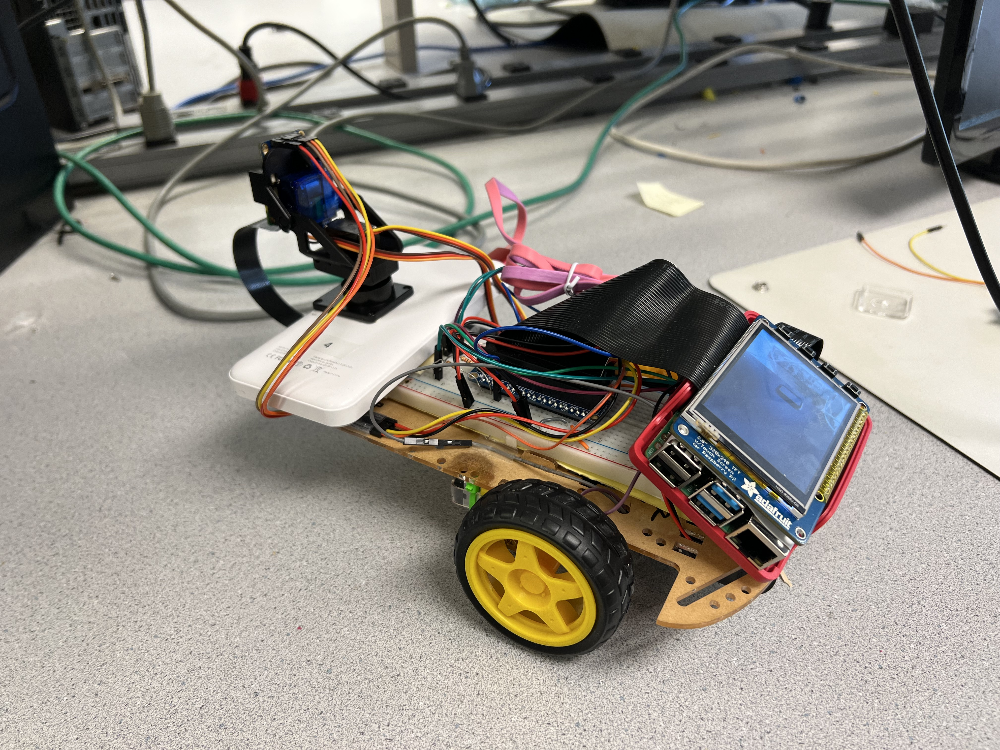

# ROBOT CAMERA SYSTEM WITH DYNAMIC OBJECT TRACKING AND STABILIZATION
## Project Installation Photo

## Introduction
This project blends hardware and software to create an interactive, multipurpose camera. Built on a Raspberry Pi 4, the system features a Pi Camera V2, a BNO055 sensor, a 2.8-inch PiTFT screen, and an attached robot car for mobility. This camera system offers three main modes: manual control, object tracking, and stabilization, with all features being accessible either through the handheld device itself or via a Flask-based web interface.  

The primary purpose of this project is to provide a compact, lightweight, user-friendly handheld camera that can track objects, stabilize images, and be controlled manually, providing smooth and high-quality footage. With the addition of the robot car, the camera system gains the ability to move and operate remotely, broadening its use-cases and adding an extra layer of convenience for the user.

## Key Features
- **Manual Control:** Aside from automatic object tracking, users also have the option to manually control the camera.
- **Object Tracking:** The camera actively tracks and centers a region of interest (ROI) selected by the user, maintaining focus regardless of the user's movement or rotation.
- **Camera Stabilization:** The camera effectively compensates for any unwanted movements, providing smooth and steady footage.
- **User Interface:** The intuitive touchscreen interface and four physical buttons allow users to easily interact with the device and switch between different modes.
- **Portability:** The system's compact and lightweight design makes it suitable for handheld use and diverse applications.
- **Remote Control:** This camera system is mounted on a moving robot car and can be controlled remotely through a web interface, adding another layer of versatility and convenience.

## Project report
For a more detailed discussion of this project including our design process, challenges encountered, testing, results, and future work, please refer to our [full project report](https://courses.ece.cornell.edu/ece5990/ECE5725_Spring2023_Projects/3%20Saturday%20May%2013/2%20Portable%20Tracking%20Camera/website/index.html).  

To see our project in action, please check out our [demonstration video](https://youtu.be/fzLD7-tCvhM).
